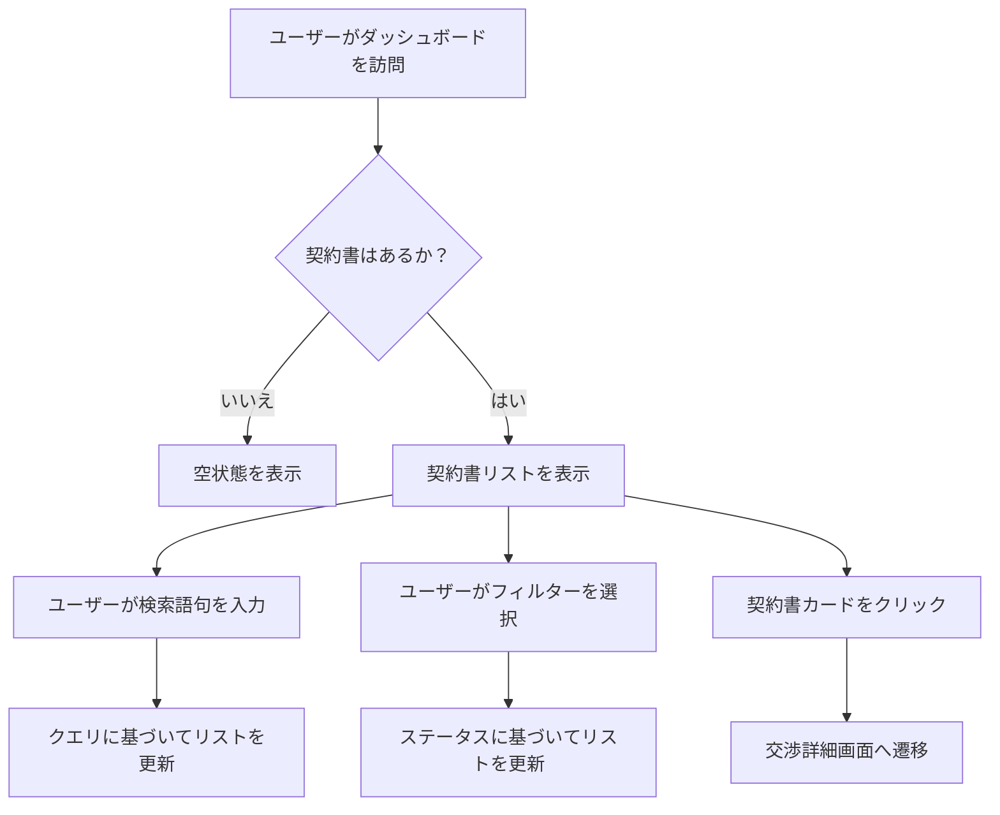

# Tech PRD: 契約書一覧画面 (List Screen)

> **【どんな画面？】**
> ログイン直後に表示されるトップページです。
> 自分が関わっている全ての契約書をここで一覧管理し、検索や状態（交渉中・合意済みなど）の確認ができます。

## 1. 画面設計 (Visual Design Spec)

### UI構成要素
- **グローバルヘッダー**: ロゴ、ユーザープロフィールアイコン。
- **アクションエリア**:
  - `[新規作成ボタン]`: "新規契約" / "アップロード" ボタン。
  - `[検索入力欄]`: 契約書名や取引先名で検索するためのテキスト入力。
  - `[フィルタードロップダウン]`: ステータス（交渉中、合意待ち、合意済み）による絞り込み。
- **契約書リストエリア**:
  - `[契約書カード]`: 各契約書の情報を表示。
    - タイトル（ホバー時または編集ボタンで編集可能）
    - 取引先名
    - ステータスバッジ（交渉中、合意待ち、合意済み）
    - 最終更新日時
    - バージョン番号
  - `[空状態イラスト]`: 契約書が存在しない場合に表示。

### 状態定義 (States)
- **読み込み中 (Loading)**: リストエリアにスケルトンローダーを表示。
- **データなし (Empty)**: "まだ契約書がありません。新しい契約をアップロードしましょう" というメッセージとボタンを表示。
- **表示中 (Populated)**: 最終更新日時の降順で契約書カードのリストを表示。
- **該当なし (No_Results)**: 検索やフィルターの結果が0件の場合、"条件に一致する契約書が見つかりません" と表示。

### ユーザーフロー (Mermaid)


## 2. 振る舞い仕様 (BDD)

```gherkin
Feature: ダッシュボード表示と検索

  Scenario: 契約書一覧の表示（データあり）
    Given ユーザーは過去に "秘密保持契約書A社", "業務委託契約書B社" をアップロードしている
    When ダッシュボードを表示する
    Then 契約書リストに "秘密保持契約書A社" と "業務委託契約書B社" が表示される
    And リストは最終更新日時の新しい順に並んでいる

  Scenario: 契約書の検索
    Given 契約書リストに "秘密保持契約書A社", "業務委託契約書B社" が表示されている
    When 検索ボックスに "A社" と入力する
    Then リストには "秘密保持契約書A社" のみが表示される
    And "業務委託契約書B社" は表示されない

  Scenario: ステータスフィルター
    Given "秘密保持契約書A社" のステータスは "交渉中" である
    And "業務委託契約書B社" のステータスは "合意済み" である
    When フィルターで "合意済み" を選択する
    Then リストには "業務委託契約書B社" のみが表示される

  Scenario: 検索結果なし
    Given 契約書リストが表示されている
    When 検索ボックスに "存在しない契約" と入力する
    Then "条件に一致する契約書が見つかりません" というメッセージが表示される
```

## 3. 非機能要件・受入基準
- **パフォーマンス**: ダッシュボードの初期表示は1秒以内に完了すること。
- **レスポンシブ**: PC画面幅での表示を最適化する（モバイルは閲覧のみ考慮）。
