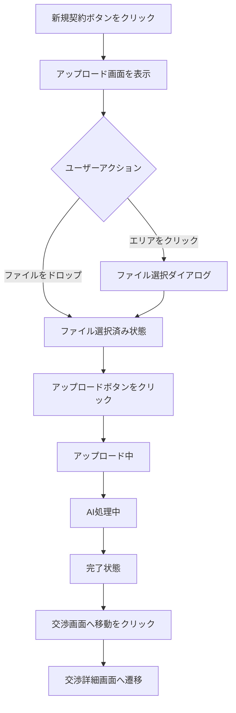

# Tech PRD: アップロード画面 (Upload Modal)

> **【どんな画面？】**
> 一覧画面で「新規契約」ボタンを押すと開く画面です。
> 契約書ファイル（WordやPDF）をここにドラッグ＆ドロップして、交渉プロジェクトを開始します。
> AIによる初期解析もここで行われます。

## 1. 画面設計 (Visual Design Spec)

### UI構成要素
- **アップロードモーダル / ページ**:
  - `[ドロップゾーン]`: ファイルをドラッグ＆ドロップするエリア。テキスト: "ここにファイルをドロップ または クリックして選択"。
  - `[ファイル選択入力]`: ドロップゾーンのクリックでトリガーされる隠しinput要素。
  - `[プレビューリスト]`: 確定前に選択されたファイルを表示。
  - `[アップロードボタン]`: "アップロード開始" ボタン（ファイル未選択時は無効）。
- **処理中オーバーレイ**:
  - `[進捗バー]`: アップロードの進捗を表示。
  - `[AI解析インジケータ]`: "AIが契約書を解析中..." のスピナー/アニメーション。
- **完了モーダル**:
  - `[完了メッセージ]`: "アップロードが完了しました"。
  - `[交渉画面へ移動ボタン]`: "交渉画面へ移動"。

### 状態定義 (States)
- **待機中 (Idle)**: ユーザーの入力を待っている状態。
- **ファイル選択済み (File_Selected)**: ファイルが選択され、アップロード準備完了。ファイル名とサイズを表示。
- **アップロード中 (Uploading)**: ファイルをサーバーへ転送中。
- **処理中 (Processing)**: アップロード完了後、システムが初期バージョン作成とAIサマリー生成を実行中。
- **完了 (Complete)**: 遷移可能な状態。
- **エラー (Error)**: アップロード失敗（ネットワークエラー、サイズ超過、無効なフォーマット）。

### ユーザーフロー (Mermaid)


## 2. 振る舞い仕様 (BDD)

```gherkin
Feature: 契約書アップロード

  Scenario: 正常なファイルのアップロード
    Given ユーザーはアップロード画面を開いている
    When "contract.docx" (Wordファイル, 5MB) をドロップする
    And "アップロード開始" ボタンをクリックする
    Then アップロード進捗バーが表示される
    And アップロード完了後、"AIが契約書を解析中..." という表示に切り替わる
    And 解析完了後、"アップロード完了" モーダルが表示される

  Scenario: 非対応フォーマットのアップロード
    Given ユーザーはアップロード画面を開いている
    When "image.png" をドロップする
    Then "対応していないファイル形式です (.docx, .pdf のみ)" というエラーメッセージが表示される
    And "アップロード開始" ボタンは無効化されたままである

  Scenario: サイズ超過ファイルのアップロード
    Given ユーザーはアップロード画面を開いている
    When "large_contract.pdf" (25MB) をドロップする
    Then "ファイルサイズが大きすぎます (上限20MB)" というエラーメッセージが表示される
    And "アップロード開始" ボタンは無効化されたままである
```

## 3. 非機能要件・受入基準
- **対応フォーマット**: .docx, .doc, .pdf
- **サイズ上限**: 1ファイルあたり最大20MB。
- **タイムアウト**: AI解析処理が30秒を超えた場合でも、バックグラウンドで処理を継続し、ユーザーには「解析に時間がかかっています」と通知して先に進めるようにする（あるいは完了通知を送る）。
