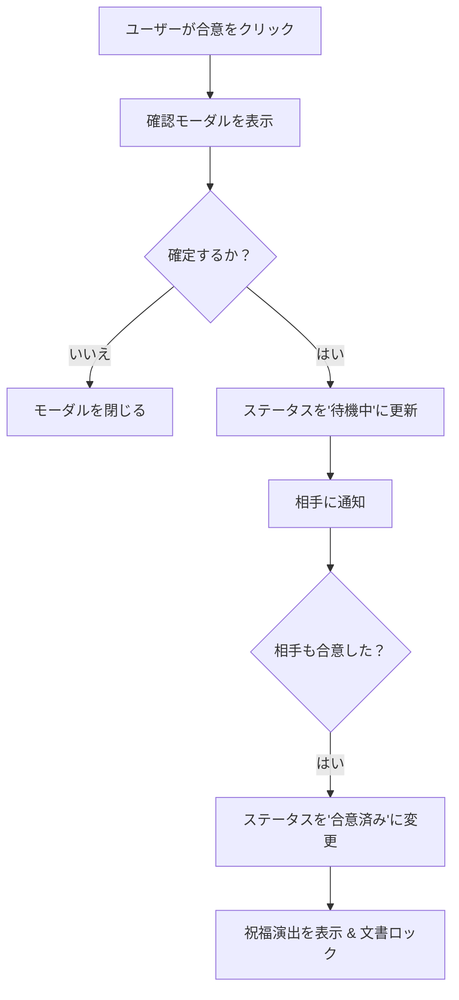

# Tech PRD: 交渉画面 - 合意プロセス (Negotiation Agreement)

> **【どんな画面？】**
> 交渉画面（詳細）の最上部にある「合意する」ボタンを押した後の流れです。
> お互いがボタンを押すと契約が成立し、紙吹雪でお祝いされます。

## 1. 画面設計 (Visual Design Spec)

### UI構成要素
- **ヘッダーアクションエリア**:
  - `[合意ボタン]`: プライマリアクションボタン。状態によってテキスト変化 ("この内容で合意する", "相手の合意待ち", "合意済み")。
- **ステータスバナー**:
  - `[ステータスインジケータ]`: 色分けされたバー (青: 交渉中, オレンジ: 待機中, 緑: 合意済み)。
  - `[ステータステキスト]`: 状態の説明テキスト。
- **合意確認モーダル**:
  - `[確認テキスト]`: "このバージョン (v1.2) で契約を締結しますか？"。
  - `[確定ボタン]`: "合意して確定"。
  - `[キャンセルボタン]`: "キャンセル"。
- **完了オーバーレイ**:
  - `[紙吹雪アニメーション]`: 祝福エフェクト。
  - `[完了メッセージ]`: "契約が成立しました！"。
  - `[締結版ダウンロードボタン]`: "契約書をダウンロード"。

### 状態定義 (States)
- **交渉中 (Negotiating)**: 双方が編集・合意可能。ボタン: "この内容で合意する"。
- **相手待ち (Waiting_For_Partner)**: 自分は合意済み、相手は未合意。ボタン: "相手の合意待ち" (無効化) または "合意を取り消す"。
- **合意済み (Agreed)**: 双方が合意。文書はロックされる。ボタン: "合意済み" (固定バッジ)。

### ユーザーフロー (Mermaid)


## 2. 振る舞い仕様 (BDD)

```gherkin
Feature: 合意プロセス

  Scenario: 自分が合意する（相手は未合意）
    Given ステータスは "交渉中" である
    When "この内容で合意する" ボタンをクリックする
    And 確認モーダルで "合意して確定" をクリックする
    Then ステータスが "相手の合意待ち" に変わる
    And 画面上部に "あなたの合意を記録しました。相手の合意を待っています" と表示される

  Scenario: 合意の取り消し
    Given ステータスは "相手の合意待ち" である
    When "合意を取り消す" ボタンをクリックする
    Then ステータスが "交渉中" に戻る
    And "合意を取り消しました" と表示される

  Scenario: 契約成立（相手が合意して完了）
    Given ステータスは "相手の合意待ち" である
    When 相手が合意操作を完了する
    Then 画面上に紙吹雪のエフェクトが表示される
    And ステータスが "合意済み" に変わる
    And 契約書の編集やコメント追加ができなくなる（ロックされる）
```

## 3. 非機能要件・受入基準
- **不変性**: 合意成立後は、そのバージョンの契約書はいかなる手段でも変更不可能（Read-only）になること。
- **監査ログ**: 誰がいつ合意ボタンを押したかのログがサーバー側に確実に残ること。
