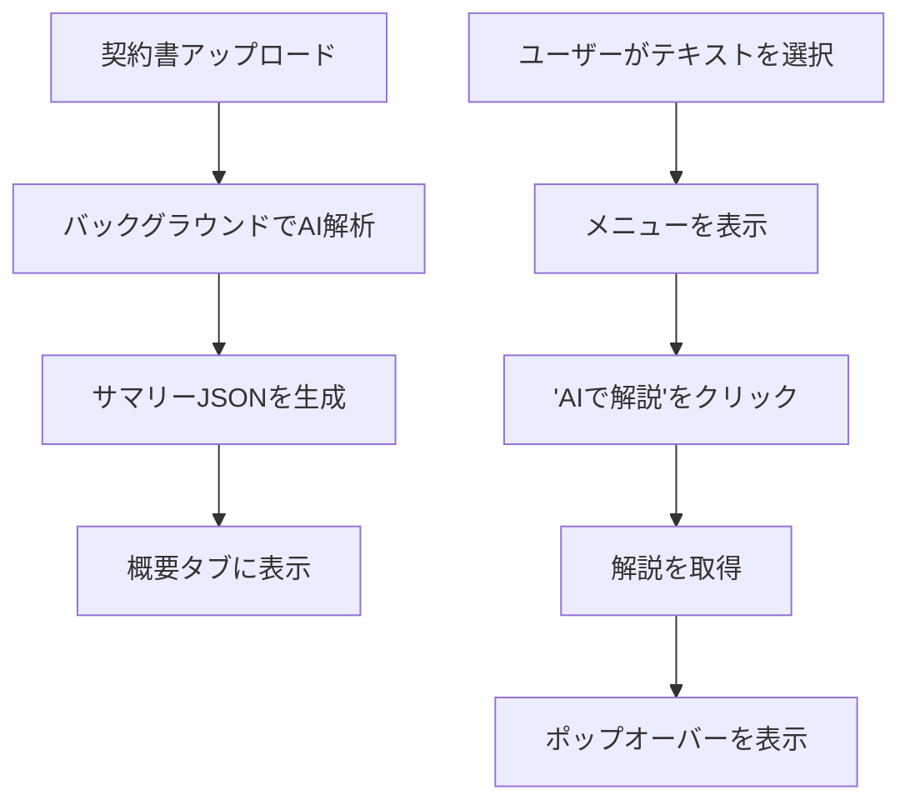

# Tech PRD: 交渉画面 - AIアシスタンス (Negotiation AI)

> **【どんな画面？】**
> 交渉画面（詳細）の「概要タブ」や、契約書本文上で使う機能です。
> AIが契約書を読み込んで「要点」をまとめてくれたり、選択した難しい条文を「わかりやすく解説」してくれます。

## 1. 画面設計 (Visual Design Spec)

### UI構成要素
- **サマリーカード** (概要タブ内):
  - `[要点リスト]`: 契約の要点をまとめた3つの箇条書き。
  - `[関係図]`: "誰が誰に支払うか" 等の取引構造の図示。
  - `[AIバッジ]`: "AI生成" バッジと免責事項のツールチップ。
- **文脈解説**:
  - `[選択メニュー]`: テキスト選択時に表示。"AIで解説" ボタンを含む。
  - `[解説ポップオーバー]`: 解説を表示するポップアップ。
- **リスクアラート**:
  - `[アラートバナー]`: "注意: 更新の拒絶通知期間が短いです" などの警告。

### 状態定義 (States)
- **生成中 (Generating)**: サマリーカードのシマー（読み込み）エフェクト。
- **表示中 (Generated)**: 生成されたコンテンツが表示されている。
- **解説読み込み中 (Explanation_Loading)**: ポップオーバー内のスピナー。
- **解説エラー (Explanation_Error)**: "解説できませんでした" 表示。

### ユーザーフロー (Mermaid)


## 2. 振る舞い仕様 (BDD)

```gherkin
Feature: AI要点サマリー

  Scenario: サマリーの自動生成
    Given 新しい契約書がアップロードされた
    When 解析が完了する
    Then 概要タブに "契約の要点" が3行で表示される
    And "AI生成" バッジが表示されている

Feature: 条文のAI解説

  Scenario: 選択範囲の解説
    Given 契約書本文を表示している
    When 難しい条文を選択し "AIで解説" ボタンをクリックする
    Then ポップアップが表示され、平易な日本語での解説が表示される
    And 解説には "法的助言ではありません" という注釈が含まれる
```

## 3. 非機能要件・受入基準
- **免責事項**: すべてのAI機能において、これが法的助言ではないことを明示するUIを含めること。
- **応答速度**: 解説生成は5秒以内に応答すること（ストリーミング表示が望ましい）。
