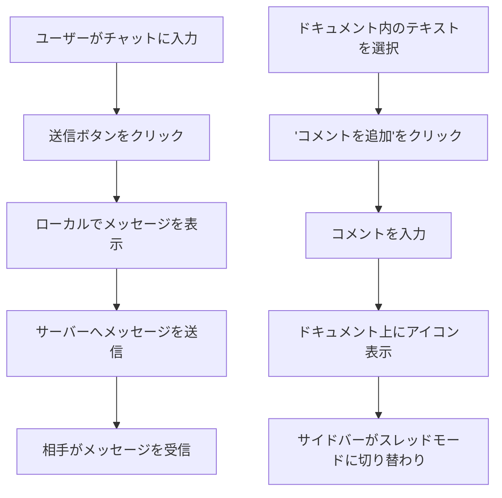

# Tech PRD: 交渉画面 - チャット＆コメント (Negotiation Chat)

> **【どんな画面？】**
> 交渉画面（詳細）の右サイドバー、および契約書本文上で操作する機能です。
> 相手とチャットで会話したり、特定の条文に「ここは修正してほしい」といったコメントを付けたりします。

## 1. 画面設計 (Visual Design Spec)

### UI構成要素
- **チャットパネル**:
  - `[メッセージリスト]`: スクロール可能なメッセージ一覧。
  - `[メッセージバブル]`: アバター、名前、送信時刻、本文。
  - `[チャット入力欄]`: テキストエリア、送信ボタン（紙飛行機アイコン）。
- **コメントシステム**:
  - `[テキストハイライト]`: ドキュメント内のコメント対象箇所をハイライト。
  - `[コメントアイコン]`: ハイライト箇所の近くにフローティング表示されるアイコン。
  - `[スレッドパネル]`: コメント選択時にチャットパネルと切り替わって表示。
    - `[元のコメント]`: スレッドの起点となるコメント。
    - `[返信リスト]`: 返信一覧。
    - `[解決ボタン]`: "解決済みにする" ボタン。
    - `[チャットへ戻るボタン]`: 全体チャットに戻る。

### 状態定義 (States)
- **チャットモード (Chat_Active)**: サイドバーのデフォルト状態。
- **スレッドモード (Thread_Active)**: 特定のコメントスレッドを表示中。
- **新着メッセージ (New_Message)**: チャットタブ/アイコンに未読インジケータを表示。
- **解決済みスレッド (Resolved_Thread)**: スレッドがグレーアウトまたは非表示（フィルター設定による）。

### ユーザーフロー (Mermaid)


## 2. 振る舞い仕様 (BDD)

```gherkin
Feature: リアルタイムチャット

  Scenario: メッセージの送信
    Given チャットパネルを開いている
    When "この条項について相談したいです" と入力して送信ボタンを押す
    Then メッセージリストの最下部に自分のメッセージが即座に追加される
    And 入力欄がクリアされる

  Scenario: メッセージの受信
    Given チャットパネルを開いている
    When 相手がメッセージを送信する
    Then メッセージリストに相手のメッセージが追加される
    And 通知音（または視覚的通知）が発生する

Feature: 契約書へのコメント

  Scenario: 新規コメントの追加
    Given 契約書テキストの "第5条" を選択している
    When "コメントを追加" ボタンを押す
    And "ここは修正が必要です" と入力して保存する
    Then 文中の "第5条" がハイライトされる
    And 右サイドバーがスレッド表示モードに切り替わり、入力したコメントが表示される

  Scenario: コメントへの返信
    Given コメントスレッドを開いている
    When "承知しました。修正します。" と入力して返信する
    Then スレッドに返信が追加される
```

## 3. 非機能要件・受入基準
- **リアルタイム性**: メッセージやコメントはWebSocket等を用いてリアルタイムに同期されること（遅延1秒以内）。
- **コンテキスト**: コメントは特定のテキスト位置（文字オフセット等）に正確に紐付くこと。文書のバージョンが変わった場合の追従ロジックは別途定義（今回はバージョンごとにコメントは固定で良い）。
