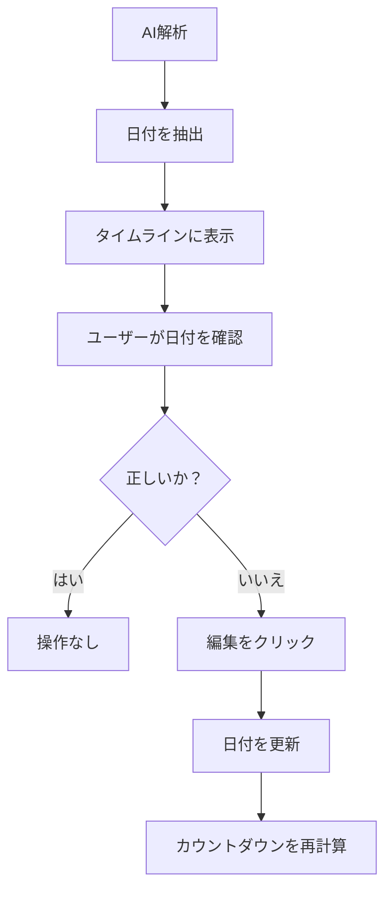

# Tech PRD: 交渉画面 - タイムライン (Negotiation Timeline)

> **【どんな画面？】**
> 交渉画面（詳細）の「概要タブ」にあるカレンダーのような機能です。
> 「契約開始日」や「更新期限」などの大事な日付をAIが自動で見つけ出し、期限が近づくとお知らせ（リマインド）してくれます。

## 1. 画面設計 (Visual Design Spec)

### UI構成要素
- **タイムラインウィジェット** (概要/管理タブ内):
  - `[タイムライン軸]`: 日付を表示する垂直線。
  - `[イベント項目]`: 日付 + ラベル（例: "2026-04-01 契約開始"）。
  - `[カウントダウンバッジ]`: "あと30日" (期限までの日数)。
- **日付エディタ**:
  - `[編集アイコン]`: 日付ホバー時に表示。
  - `[日付ピッカー]`: 日付変更用。
- **リマインド設定**:
  - `[トグルスイッチ]`: リマインドの有効/無効。
  - `[タイミング選択]`: "1週間前", "3日前", "当日"。

### 状態定義 (States)
- **自動検出 (Auto_Detected)**: AIによって抽出された日付。
- **ユーザー修正済み (User_Modified)**: 手動で修正された日付（フラグ付きで区別）。
- **期限超過 (Overdue)**: 日付を過ぎている（赤字表示）。

### ユーザーフロー (Mermaid)


## 2. 振る舞い仕様 (BDD)

```gherkin
Feature: タイムライン管理

  Scenario: 重要日付の表示
    Given AI解析により "契約終了日" が "2027-03-31" と抽出された
    When 概要タブを表示する
    Then タイムラインに "2027-03-31 契約終了日" が表示される
    And 本日が "2026-04-01" の場合、"あと364日" と表示される

  Scenario: 日付の修正
    Given "契約開始日" が誤って "2026-05-01" と表示されている
    When 編集アイコンをクリックし "2026-04-01" に変更する
    Then タイムラインの日付が更新される
    And 以降のリマインドはこの新しい日付に基づいて行われる

Feature: リマインド設定

  Scenario: 更新リマインドの有効化
    Given "更新判断期限" が設定されている
    When リマインド設定で "1週間前" にチェックを入れる
    Then 期限の7日前に通知メールが送信される設定が保存される
```

## 3. 非機能要件・受入基準
- **精度担保**: AIの日付抽出精度は100%ではないため、必ずユーザーが修正できるUIを提供すること。
- **タイムゾーン**: すべての日付はJST（日本標準時）として扱う（将来的に多国籍対応する場合はUTC考慮が必要だが、現状はJST固定で可）。
