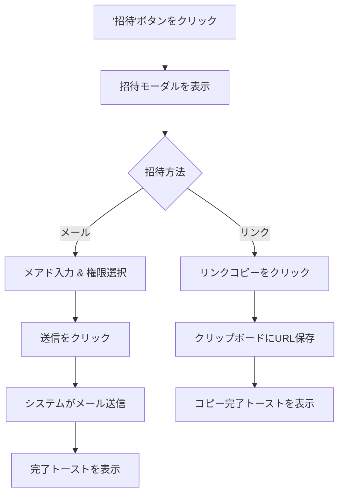

# Tech PRD: 招待モーダル (Invite Modal)

> **【どんな画面？】**
> 交渉画面（詳細）の「招待」ボタンを押すと開く画面です。
> 取引先の相手や、社内のチームメンバーをこの交渉プロジェクトに招待します。

## 1. 画面設計 (Visual Design Spec)

### UI構成要素
- **招待モーダル**:
  - `[メール入力欄]`: メールアドレス用テキストフィールド。
  - `[権限セレクタ]`: ドロップダウン (合意権限あり / メンバー)。デフォルト: 合意権限あり。
  - `[招待送信ボタン]`: "招待を送信"。
  - `[リンクコピーボタン]`: "招待リンクをコピー"。
- **メンバーリストパネル** (交渉詳細 > 管理タブ内):
  - `[メンバー行]`: アバター、名前/メール、権限バッジ、ステータス（招待中/参加済み）。
  - `[メンバー削除ボタン]`: アクセス権を削除するアイコン。

### 状態定義 (States)
- **入力待機 (Modal_Idle)**: 入力が空の状態。
- **入力有効 (Input_Valid)**: 有効なメール形式が入力され、送信ボタンが有効化された状態。
- **送信中 (Sending)**: 送信ボタン上のスピナー。
- **送信成功 (Sent_Success)**: "招待メールを送信しました" のトースト表示。
- **リンクコピー済み (Link_Copied)**: "リンクをクリップボードにコピーしました" のトースト表示。

### ユーザーフロー (Mermaid)


## 2. 振る舞い仕様 (BDD)

```gherkin
Feature: メンバー招待と権限設定

  Scenario: メールアドレスでの招待（正常系）
    Given ユーザーは招待モーダルを開いている
    When "partner@example.com" を入力する
    And 権限で "合意権限あり(Signer)" を選択する
    And "招待を送信" ボタンをクリックする
    Then モーダルが閉じられる
    And "partner@example.com に招待メールを送信しました" というメッセージが表示される
    And メンバーリストに "partner@example.com" が "招待中" ステータスで追加される

  Scenario: 招待リンクのコピー
    Given ユーザーは招待モーダルを開いている
    When "招待リンクをコピー" ボタンをクリックする
    Then "リンクをコピーしました" というメッセージが表示される
    And クリップボードに招待URLが保存されている

  Scenario: 無効なメールアドレス
    Given ユーザーは招待モーダルを開いている
    When "invalid-email" と入力する
    Then "正しいメールアドレス形式で入力してください" というエラーが表示される
    And "招待を送信" ボタンは無効化されている
```

## 3. 非機能要件・受入基準
- **セキュリティ**: 招待リンクは推測不可能なトークンを含むこと。
- **アクセス制御**: 招待されたユーザー以外は（リンクを知っていても）アクセスできないようにする（要ログイン）。
- **権限定義**:
  - **合意権限あり (Signer)**: 編集、コメント、および "合意" の実行が可能。
  - **メンバー (Member)**: 編集、コメントは可能だが、"合意" は実行不可。
